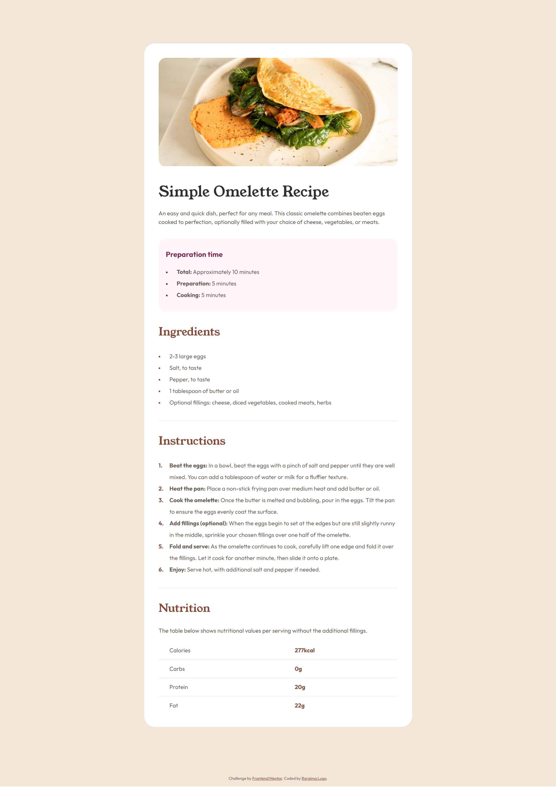

# Frontend Mentor - Recipe page

This is a solution to the [Recipe page challenge on Frontend Mentor](https://www.frontendmentor.io/challenges/recipe-page-KiTsR8QQKm). 

## Overview

### Screenshot

## My process

### Built with

- Semantic HTML5 markup
- CSS custom properties

## Author

- Website - [Recipe Page](https://www.your-site.com)
- Frontend Mentor - [@roraima1986](https://www.frontendmentor.io/profile/roraima1986)

